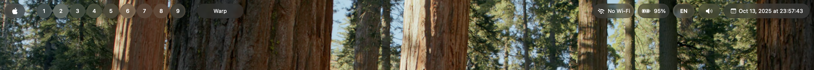
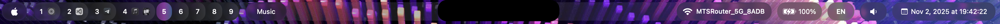
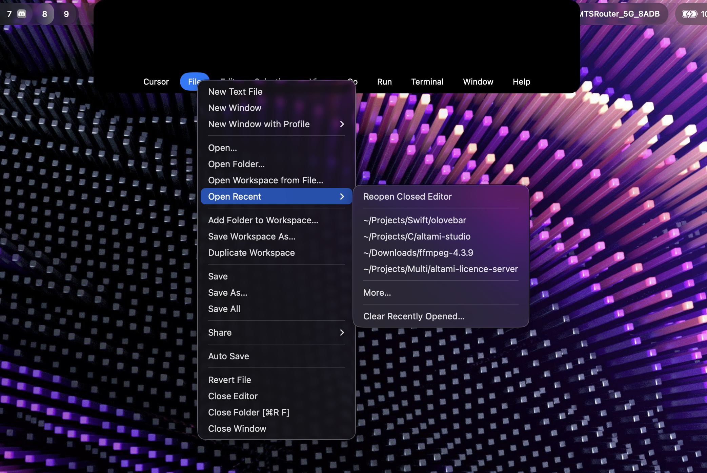
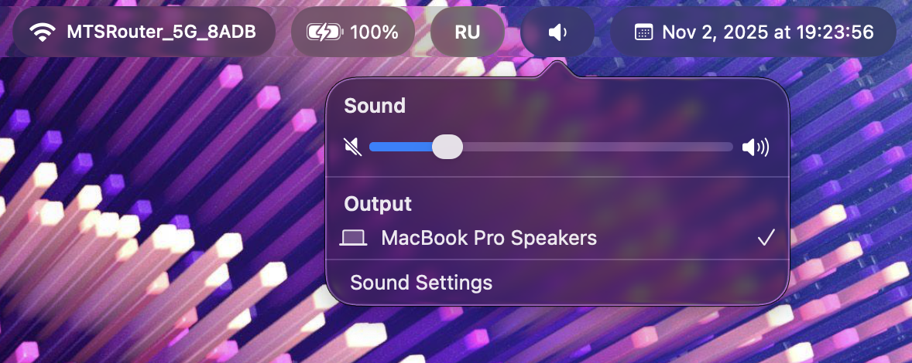

# Olovebar


**Olovebar** is a Swift-based, fully customizable menu bar inspired by Apple's **Liquid Glass** design philosophy.

All widgets are clickable and behave like native macOS menu bar widgets. You can customize the glass style of the menu bar via the **config menu** (right-click on the Apple logo widget), including:

- Widget types  
- Widget arrangement  
- Widget width  
- Corner rounding  

The **Aerospace widget** is updated via shell only, but it will be fully configurable soon.  

---

## Roadmap

### Completed

- [x] Notch View
- [x] Menu items
- [x] Configurations
- [x] Volume controls like native
- [x] Aerospace fancy UI
- [x] Migration from timers to system notifications
- [x] Good performance
- [x] Power widget like native

### Planned

- [ ] Notch Player Widget
- [ ] WiFi controls like native menu bar
- [ ] Battery controls like native menu bar
- [ ] Aerospace widget color configurations
- [ ] Notch window configurations
- [ ] Tinting app icons
- [ ] Aerospace updates through notifications (will be configurable)
- [ ] Better animations
- [ ] WiFi widget optional name configuration
- [ ] CPU widget
- [ ] Memory Widget
- [ ] NetLoad Widget
- [ ] Widget reordering
- [ ] Removing/Adding widgets into the bar

## Screenshots

### Main Styles

Left-click on the Apple logo to toggle the background style between **Glass** and **Fully Transparent**:




### Notch Widget



### Volume Control



### Settings Menu


---

## Requirements

- macOS 26+
- [AeroSpace](https://github.com/nikitabobko/AeroSpace) window manager

---

## Installation

1. **Clone the repository:**

```sh
git clone https://github.com/SacrilegeWasTaken/olovebar.git
cd olovebar
```

2. **Install to system:**

```sh
make install
```

This will:
- Check and install dependencies (Homebrew, Swift, uv)
- Build the release binary
- Install to `/usr/local/bin/olovebar`

3. **Run:**

```sh
olovebar
```

---

## Development

```sh
make setup    # Check/install dependencies
make build    # Build debug version
make run      # Build and run debug version
make release  # Build release version
```

---

## Uninstall

```sh
make uninstall
```

