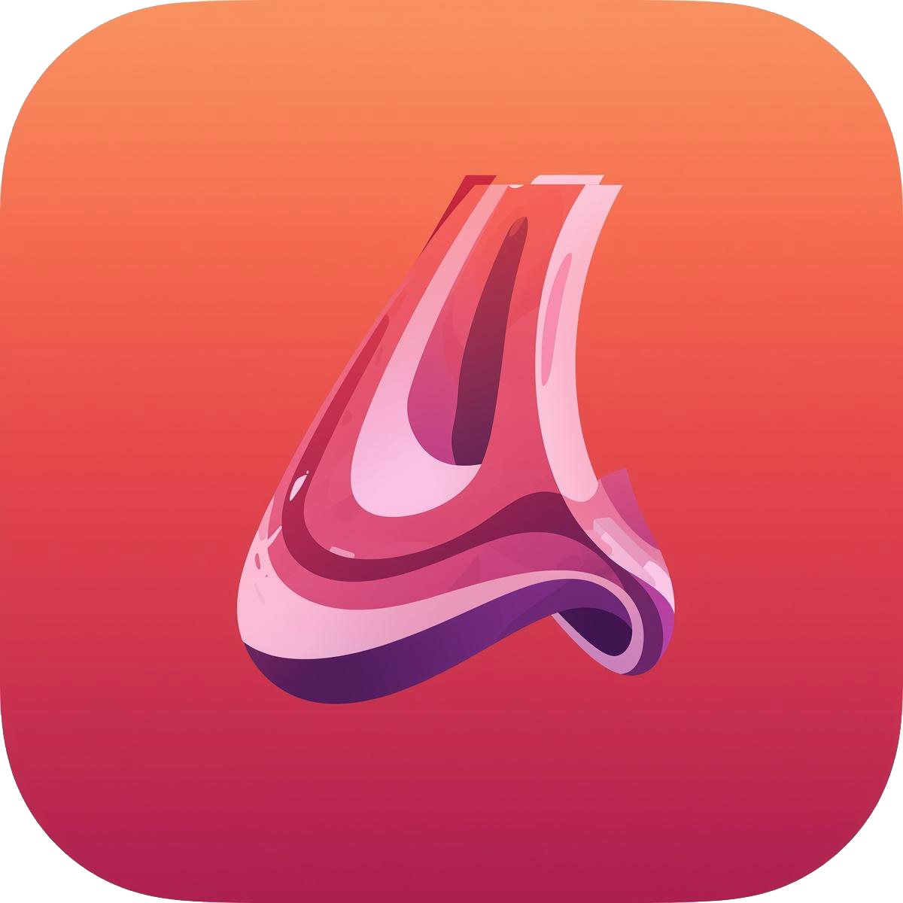
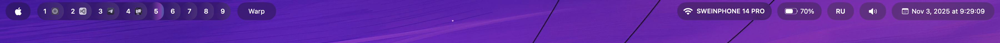
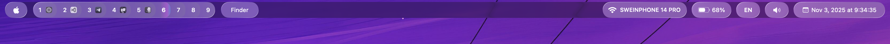
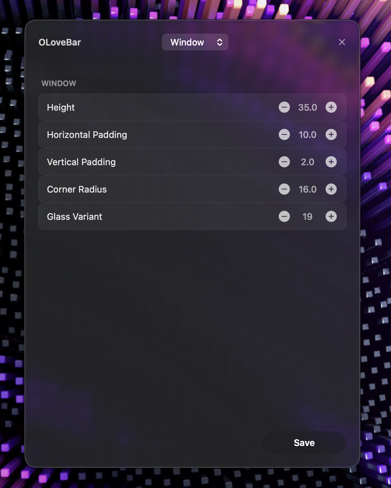

# Olovebar


**Olovebar** is a Swift-based, fully customizable menu bar inspired by Apple's **Liquid Glass** design philosophy.

<p align="center">
  
</p>

All widgets are clickable and behave like native macOS menu bar widgets. You can customize the glass style of the menu bar via the **config menu** (right-click on the Apple logo widget), including:

- Widget types  
- Widget arrangement  
- Widget width  
- Corner rounding  

The **Aerospace widget** is updated via shell only, but it will be fully configurable soon.  

---

## Roadmap

### Completed

- [x] Notch View
- [x] Menu items
- [x] Configurations
- [x] Volume controls like native
- [x] Aerospace fancy UI
- [x] Migration from timers to system notifications
- [x] Good performance
- [x] Power widget like native
- [x] Notch fancy animations
- [x] No notch background while expanded
- [x] Invisible notch on screenshots
- [x] Notch menu items centered below button like in native bar
- [x] Aerospace updates through notifications
- [x] WiFi widget optional name configuration
- [x] Migrate from `SwiftUI` popover to `NSMenu` everywhere

### Planned

- [ ] Notch Player Widget
- [ ] WiFi controls like native menu bar
- [ ] Battery controls like native menu bar
- [ ] Aerospace widget color configurations
- [ ] Notch window configurations
- [ ] Notch all control center widgets
- [ ] Tinting app icons
- [ ] Better and fast animations
- [ ] CPU widget
- [ ] Memory Widget
- [ ] NetLoad Widget
- [ ] Widget reordering
- [ ] Removing/Adding widgets into the bar
- [ ] Deep Aerospace integration with Aerospace to increase UI reaction speed.

## Screenshots

### Main Styles

Left-click on the Apple logo to toggle the background style between **Glass** and **Fully Transparent**:




### Notch Widget


### Volume Control


### Settings Menu




---

## Requirements

- macOS 26+
- [AeroSpace](https://github.com/nikitabobko/AeroSpace) window manager

---

# Installation

**Note! I'm not enrolled Apple Developer yet, so you have to remove codesign checking attrubite manually**

1. **Download the [latest release .dmg](https://github.com/SacrilegeWasTaken/olovebar/releases)**

2. **Open .dmg and drag-n-drop OLoveBar into Applications folder link**

3. **Run the following into the terminal**
```sh
sudo xattr -d com.apple.quarantine /Applications/OLoveBar.app
```

4. **Add the following into `~/.config/aerospace/aerospace.toml`**
```toml
exec-on-workspace-change = [
  "/bin/zsh",
  "-c",
  "curl -s localhost:43551"
]
```
