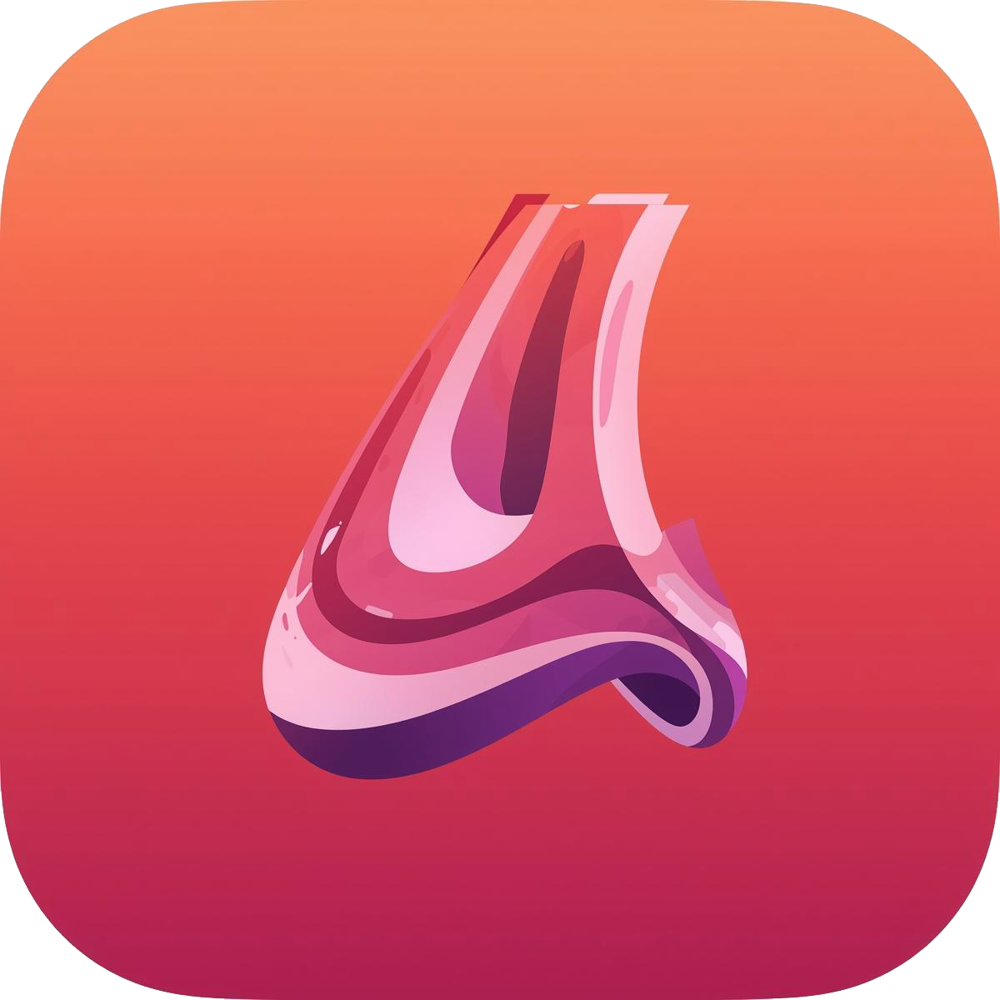
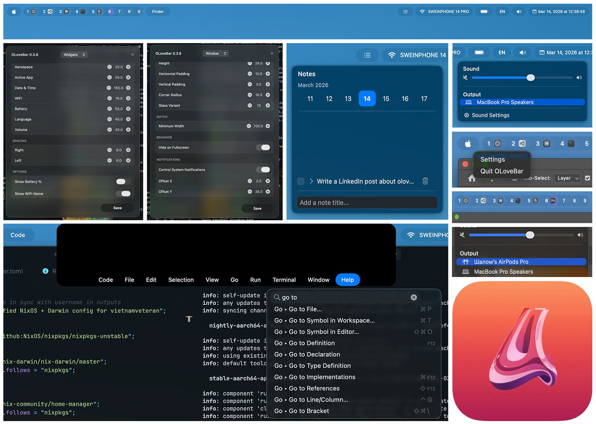

# Olovebar


**Olovebar** is a Swift-based, fully customizable menu bar inspired by Apple's **Liquid Glass** design philosophy.

<p align="center">
  
</p>

All widgets are clickable and behave like native macOS menu bar widgets. You can customize the glass style of the menu bar via the **config menu** (right-click on the Apple logo widget), including:

- Widget types  
- Widget arrangement  
- Widget width  
- Corner rounding  

The **Aerospace widget** is updated via shell only, but it will be fully configurable soon.  

---

## Roadmap

### Completed

- [x] Notch View
- [x] Menu items
- [x] Configurations
- [x] Volume controls like native
- [x] Aerospace fancy UI
- [x] Migration from timers to system notifications
- [x] Good performance
- [x] Power widget like native
- [x] Notch fancy animations
- [x] No notch background while expanded
- [x] Invisible notch on screenshots
- [x] Notch menu items centered below button like in native bar
- [x] Aerospace updates through notifications
- [x] WiFi widget optional name configuration
- [x] Migrate from `SwiftUI` popover to `NSMenu` everywhere
- [x] Notch Player Widget
- [x] Deep Aerospace integration with Aerospace to increase UI reaction speed.
- [x] System Notification offset controls.
- [x] Keyboard brightness controls in Notch

### Planned

- [ ] WiFi controls like native menu bar
- [ ] Battery controls like native menu bar
- [ ] Aerospace widget color configurations
- [ ] Notch window configurations
- [ ] Notch all control center widgets
- [ ] Tinting app icons
- [ ] Better and fast animations
- [ ] CPU widget
- [ ] Memory Widget
- [ ] NetLoad Widget
- [ ] Widget reordering
- [ ] Removing/Adding widgets into the bar
---

## Requirements

- macOS 26+
- [AeroSpace](https://github.com/nikitabobko/AeroSpace) window manager

---

# Installation

**Homebrew**
```sh
# pointing to codeberg tap repo
brew tap sacrilegewastaken/tap https://codeberg.org/sacrilegewastaken/tap.git 
# pointing to github tap repo
brew tap SacrilegeWasTaken/tap
# now install
brew install --cask olovebar
```

**Nix**
Add this to your flake inputs
```nix
inputs = {
  ...
  olovebar.url = "git+https://codeberg.org/sacrilegewastaken/olovebar.git";
};
```

And this to your system packages
```nix
environment.systemPackages = [
  olovebar.packages.aarch64-darwin.default
];
```
You can also use nix-homebrew, you can check the configuration in my [nix repository](https://codeberg.org/sacrilegewastaken/nix)
## Screenshots


