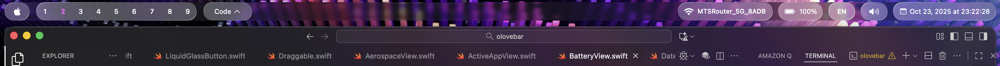

# Olovebar


\


Olovebar is a Swift-based project designed to provide innovative solutions for modern application development. This project aims to streamline workflows, enhance productivity, and deliver a seamless user experience.

# Install / Running
1. Install Aerospace and configure it.
2. Clone the repo.
```sh
git clone https://github.com/SacrilegeWasTaken/olovebar.git
```
3. Build the binary via swift
```sh
swift build
```
4. Run the binary
```sh
./.build/arm64-apple-macosx/debug/olovebar
```