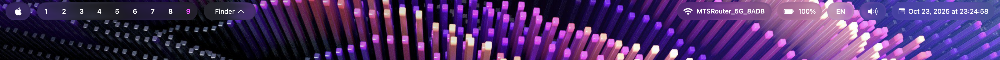
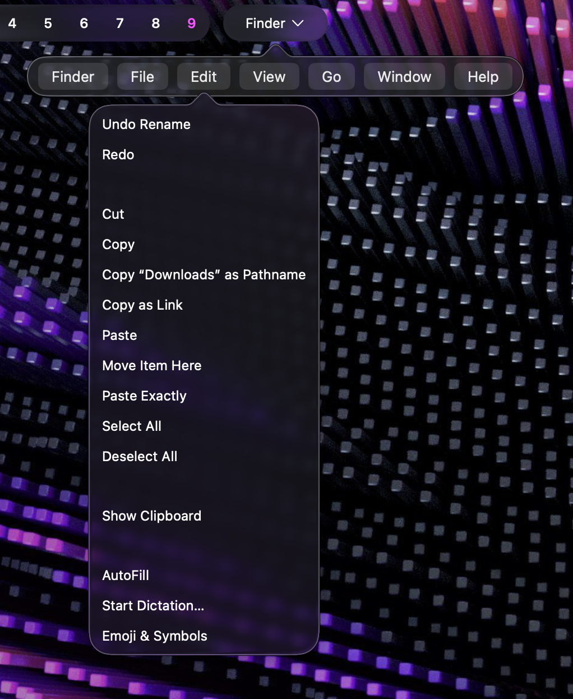

# Olovebar

**Olovebar** is a Swift-based, fully customizable menu bar inspired by Apple's **Liquid Glass** design philosophy.

All widgets are clickable and behave like native macOS menu bar widgets. You can customize the glass style of the menu bar via the **config menu** (right-click on the Apple logo widget), including:

- Widget types  
- Widget arrangement  
- Widget width  
- Corner rounding  

The **Aerospace widget** is updated via shell only, but it will be fully configurable soon.  

---

## Screenshots

### Main Styles

Left-click on the Apple logo to toggle the background style between **Glass** and **Fully Transparent**:




### Active App Widget

The Active App widget is fully functional and provides all the benefits of the default macOS menu bar:



### Settings Menu


---

## Installation / Running

1. **Install Aerospace** and configure it.  
2. **Clone this repository:**


```sh
git clone https://github.com/SacrilegeWasTaken/olovebar.git
```
3. Build the binary via swift
```sh
swift build
```
4. Run the binary
```sh
./.build/arm64-apple-macosx/debug/olovebar
```